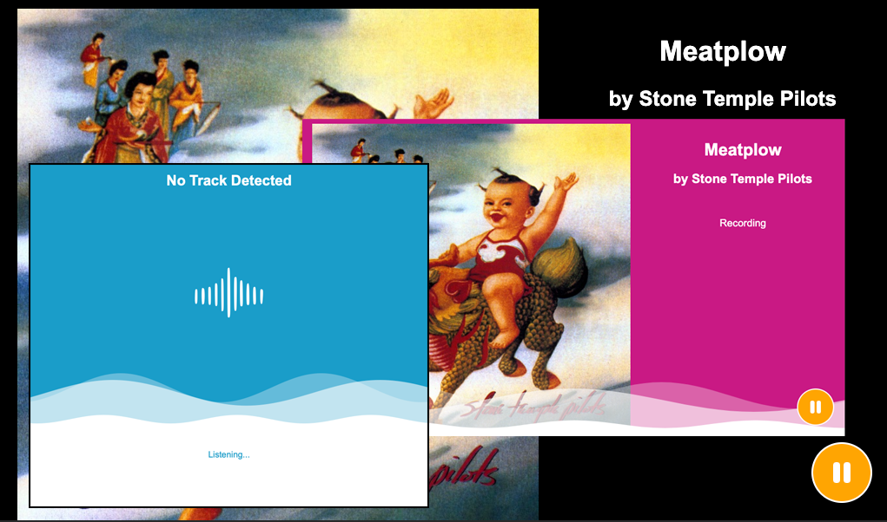

# pi-music-display


A microservices-based remote display system for showcasing album artwork and track metadata of currently playing songs. This project uses a Node.js/Express server as a proxy to a Python FastAPI microservice that leverages [shazamio](https://github.com/shazamio/ShazamIO) to recognize songs from audio files. The system is containerized with Docker Compose to simplify development, testing, and eventual to a Raspberry Pi.



## Project Purpose

The goal of **pi-music-display** is to create an interactive, remote display that automatically updates with the album artwork, title, artist, and other metadata of any song playing in its vicinity. This can be used in settings such as home entertainment, public installations, or as a creative art project.

## Features

- **Audio Recognition:** Uses shazamio in a Python FastAPI microservice to identify songs from an audio sample.
- **Proxy Server:** A Node.js/Express server listens for audio signals and records audio if present and uploads them to the Python service for song recognition.
- **Containerized Development:** Docker Compose is used to orchestrate both the Node.js and Python services.
- **Automated Testing:** Tests written with Mocha (for Node.js) and pytest (for Python) ensure the endpoints and integrations work as expected.
- **Configurable Environment:** A minimal ```.env``` file is used to define configuration variables (e.g., server PORT).

## Tested Devices
Currently tested on Raspberry Pi 1 and 5

- **Raspberry Pi 1**: The Architecture doesn't support the needed python libraries.
- **Raspberry Pi 5**: Works great with no issues.

## Local Development Setup

### Prerequisites

- **Node.js** (v21.4.0 or later) and **npm** installed on your machine.
- **Docker Desktop** installed and running.
- (Optional) **Python 3.12** if you wish to run Python tests locally outside Docker.

### Repository Setup

1. **Clone the repository:**

   ```bash
   git clone https://github.com/paulboutin/pi-music-display.git
   cd pi-music-display
   ```

2. **Install Node.js Dependencies:**

    ```bash
    npm install
    ```

3. **Configure Environment Variables:**

    Create a .env file in the project root with at least:
    PORT=3000

### Docker Setup

This project uses Docker Compose to run both services (Node.js and Python).

1. **Build and Launch the Stack:**

    ```bash
    npm run docker:up
    ```

This command builds both the Node.js and Python Docker images and starts the containers. By default, the Node.js service runs on port 3000 (as set in ```.env```), and the Python FastAPI service runs on port 8000.

## Running Tests

### Node.js Tests

Node.js tests are written using Mocha and Supertest.

Run them with:

   ```bash
   npm test
   ```

### Python Tests

Python tests (located in /tests/python/) use pytest.
To run the Python tests inside a Docker container, use:

   ```bash
   npm run docker:run-python
   ```

This command mounts your project directory into the Python container and runs:

   ```bash
   python -m pytest tests/python
   ```

## Project Structure

    pi-music-display/
    ├── app.js                # Express application
    ├── index.js              # Entry point for the Node.js server
    ├── main.py               # Entry point for the Python server
    ├── package.json          # Node.js project configuration and scripts
    ├── .env                  # Environment variables
    ├── Dockerfile            # Dockerfile for the Node.js service
    ├── Dockerfile.python     # Dockerfile for the Python FastAPI service
    ├── docker-compose.yml    # Docker Compose configuration
    ├── requirements.txt      # Python dependencies
    └── test/
        ├── api.test.js       # Node.js tests (Mocha/Supertest)
        └── python/
            └── test_main.py  # Python tests (pytest)
    └── views/
        ├── index.ejs         # Express template for main display

## Build and Deployment

- Local Development: Run npm run docker:up to build and start both services.
- Production Deployment: Adjust environment variables as needed and deploy the Docker containers to your target environment (e.g., a Raspberry Pi running Docker).

## Manual Testing

- Testing Considerations for lack of Mic access:
    When testing locally with Docker running both services you can test the Display and the API connectivity and response by hitting the test url http://localhost:3000/simulate-voice to send the test audio file to the Shazam API. You can then see the Express service update the Display with the album artwork at http://localhost:3000/.

## Customizing the Display Template

To modify the front-end template to tailor the display of album artwork and track metadata according to your project needs. The current implementation uses an EJS template (located in the ```views``` directory) to render data from the Shazam API. Here are some guidelines to help you customize the template:

### Locating the Template

- Template File:
The main template is found at ```views/index.ejs```. This file contains the HTML structure and EJS placeholders for dynamic content such as:
- ```<%= track.title %>```
- ```<%= track.subtitle %>```
- ```<%= track.images.coverart %>```

### Modifying Data Display
- Adding/Removing Data Fields:
    The JSON response from the Shazam API includes various properties (e.g., ```track.title```, ```track.subtitle```, ```track.images```, ```track.share```, etc.). To display additional information (such as album label, release date, or related tracks), simply add new markup in the EJS file. For example:
    ```ejs
    <div class="track-details">
      <h1><%= track.title %></h1>
      <h2>by <%= track.subtitle %></h2>
      <!-- Additional metadata -->
      <% if (track.label) { %>
        <p>Label: <%= track.label %></p>
      <% } %>
    </div>
    ```

- Conditional Rendering:
    Use EJS conditional statements to include or exclude certain data based on its availability:
    ```ejs
    <% if (track.images && track.images.coverarthq) { %>
      " alt="High Quality Cover Art">
    <% } else { %>
      " alt="Cover Art">
    <% } %>
    ```

### Customizing Styles

- CSS Adjustments:
    You can modify inline styles or link an external CSS file within the template to change the look and feel. For example, to update the layout, colors, or fonts, add or modify CSS rules either directly in the ```<style>``` block in the EJS file or via an external stylesheet that you reference:
    ```html
    <link rel="stylesheet" href="/styles/main.css">
    ```
    Then, in your public/styles/main.css:
    ```css
    body {
    background-color: #f4f4f4;
    font-family: 'Arial', sans-serif;
    }
    .track-details h1 {
    font-size: 2em;
    color: #333;
    }
    ```

### Updating Server Code for Additional Data

- Passing More Data:
    If you modify the template to display additional fields that aren’t currently part of the data sent by your Express route, update your server code accordingly. For example, in ```app.js```:
    ```javascript
    app.get('/', (req, res) => {
    // Modify or enrich trackData as needed
    const trackData = { /* retrieve or structure your track data here */ };
    res.render('index', { track: trackData });
    });
    ```
### Testing Your Changes

- Local Development:
    Run your Node.js server locally (or inside Docker) and navigate to http://localhost:3000 to see your changes in action.
- Iteration:
    Make iterative changes to the EJS file and CSS until the display meets your requirements.


## Prerequisites and Setup on the Raspberry Pi

### 1. Operating System

- Raspberry Pi OS:
    Install Raspberry Pi OS (preferably the Lite version if you don’t need a desktop environment, or the full version if you want one). Use the Raspberry Pi Imager application and follow instructions for your card on the [Raspberry Pi website](https://www.raspberrypi.com/software/).

- Get access to your system either directly or over SSH. You'll need to run commands via the terminal to get this all set up. Instructions are on the site.

- Updates:
    Once installed, update your system:

    ```bash
    sudo apt update
    sudo apt upgrade -y
    ```

### 2. Docker and Docker Compose

- Install Docker:
    Use the official convenience script to install Docker:

    ```bash
    curl -fsSL https://get.docker.com -o get-docker.sh
    sudo sh get-docker.sh
    ```

- Add Your User to the Docker Group and Audio Group:
    To run Docker commands without sudo and allow the docker user access to audio devices:

    ```bash
    sudo usermod -aG docker $USER
    sudo usermod -aG audio $USER
    ```

    Log out and back in for the group change to take effect.

- Install Docker Compose:
    On newer Raspberry Pi OS images (especially Bullseye-based), Docker Compose may already be available as a plugin. Verify with:

    ```bash
    docker compose version
    ```

    If not, you can install it using:

    ```bash
    sudo apt-get install docker-compose -y
    ```

    Alternatively, follow the official Docker documentation for installing Docker Compose on ARM devices.

### 3. Microphone and Audio Access

- Hardware Setup:
    Connect your USB microphone (or any supported microphone) to the Raspberry Pi. Verify that it is recognized by listing available recording devices:

    ```bash
    arecord -l
    ```

- Audio Drivers and Utilities:
    Ensure that ALSA utilities are installed:

    ```bash
    sudo apt-get install alsa-utils -y
    ```

- Configuration:
    Sometimes you may need to adjust your Pi’s audio settings (in ```/etc/asound.conf``` or via ```alsamixer```) to set the correct default input device. Test microphone capture using a command like:

    ```bash
    arecord -d 5 test.wav
    aplay test.wav
    ```

- Testing Considerations for lack of Mic access:
    When testing locally with Docker running both services you can test the Display and the API connectivity and response by hitting the test url http://localhost:3000/simulate-voice to send the test audio file to the Shazam API. You can then see the Express service update the Display with the album artwork at http://localhost:3000/.

### 4. Network and Firewall

- Ports:
    Make sure that the ports you plan to use (for example, 3000 for Node.js and 8000 for the Python service) are open and not blocked by any firewall on your network.

- WiFi/Ethernet:
    Ensure your Pi has a stable network connection, whether via WiFi or Ethernet.

### 5. Deployment of Your Dockerized Application

- Transfer Your Code:
    You can clone your GitHub repository onto the Pi:
    (This will require you to install git cli and configure permissions and possibly ssh keys for git access)

    ```bash
    git clone https://github.com/paulboutin/pi-music-display.git
    cd pi-music-display
    ```

    If the you don’t have Git installed or configured you can opt to manually download the zip file of this repo. 
    To do so, run the following commands on your Pi:

    Install unzip
    ```bash
    sudo apt install unzip
    ```

    Download the ZIP file of the main branch
    ```bash
    curl -LO https://github.com/paulboutin/pi-music-display/archive/refs/heads/main.zip
    ```

    Unzip the downloaded file
    ```bash
    unzip main.zip
    ```

    cleanup the unneeded file
    ```bash
    rm main.zip
    ```

    Change into the project directory (the folder name might include the branch name)
    ```bash
    cd pi-music-display-main
    ```

    This avoids the need for Git CLI and can simplify the installation process.

- Environment Variables:
    Ensure you have your ```.env``` file on the Pi with the necessary variables (e.g., ```PORT=3000```).

    ```bash
    touch .env
    echo "PORT=3000" > .env
    ```

- Build and Run with Docker Compose:
    Use Docker Compose setup to build and start both services (Be sure to use the same user you granted access to sudo to run Docker):

    ```bash
    docker compose up --build
    ```

    This will launch the Node.js service (and the Python FastAPI service) as defined in your ```docker-compose.yml``` file.

### 6. Optional: Setting Up Autostart on Boot

To have your application start automatically when the Pi boots, you can create a systemd service file.
For example, create a file ```/etc/systemd/system/pi-music-display.service``` with the following content:

**_NOTE:_** Replace $USER with the user that has permission to run docker from step 2 above.

```ini
[Unit]
Description=Pi Music Display Application
After=docker.service
Requires=docker.service

[Service]
WorkingDirectory=/home/$USER/pi-music-display
ExecStart=/usr/bin/docker compose up --build
ExecStop=/usr/bin/docker compose down
Restart=always
User=$USER

[Install]
WantedBy=multi-user.target
```

Then enable and start the service:

```bash
sudo systemctl enable pi-music-display.service
sudo systemctl start pi-music-display.service
```

In order to write the contents to a file you may consider using ```vi``` as ```vim``` is not installed by default on Raspberry Pi.

```bash
vi /etc/systemd/system/pi-music-display.service
```

### 7. Install Chromium to launch a browser in kiosk mode

If Chromium isn’t already installed on your Pi, install it with:

```bash
sudo apt-get update
sudo apt-get install chromium-browser
```

### 8. Create a Startup Script
Create a script (for example, /home/$USER/start-kiosk.sh) that launches Chromium in kiosk mode with your URL:

**_NOTE:_** Replace $USER with your docker user
```bash
#!/bin/bash
# Wait a few seconds to allow services to start
sleep 10
# Launch Chromium in kiosk mode
chromium-browser --kiosk --noerrdialogs --enable-features=OverlayScrollbar --disable-restore-session-state http://localhost:3000
```

Make the script executable:
**_NOTE:_** Replace $USER with your docker user

```bash
chmod +x /home/$USER/start-kiosk.sh
```

### 9. Create a systemd Service File
Create a service file (for example, /etc/systemd/system/kiosk.service) with the following content:

**_NOTE:_** Replace $user with your docker user

```ini
[Unit]
Description=Kiosk Mode Browser
After=graphical.target

[Service]
User=$USER
Environment=DISPLAY=:0
ExecStart=/home/$USER/start-kiosk.sh
Restart=no

[Install]
WantedBy=graphical.target
```

`User=pi:` Runs the service as the “pi” user.

`Environment=DISPLAY=:0:` Specifies the X display (adjust if your display is different).

`After=graphical.target:` Ensures the service starts only after the graphical environment is up.


### 10. Enable and Test the Service
Enable the service to start at boot:

```bash
sudo systemctl enable kiosk.service
```
Now, either start it manually with:
```bash
sudo systemctl start kiosk.service
```
Or reboot your Pi:
```bash
sudo reboot
```
After reboot, Chromium should launch in full‑screen mode pointing to http://localhost:3000.

Alternative Method: LXSession Autostart
If your Raspberry Pi runs a desktop environment (LXDE on Raspberry Pi OS), you can also add an autostart entry. 

Create or edit the file:
```bash
nano ~/.config/lxsession/LXDE-pi/autostart
```
Add this line:
```bash
@chromium-browser --kiosk http://localhost:3000
```
Save and reboot. This method will also launch Chromium in kiosk mode when the desktop environment starts.


## License

This project is licensed under the [MIT License](https://chatgpt.com/c/LICENSE).

## Acknowledgements

[shazamio](https://github.com/shazamio/ShazamIO) for providing the song recognition capabilities.
Express, FastAPI, Docker, and the broader open source community for their excellent frameworks and tools.


## Contributing & Getting Involved

We welcome contributions from developers and testers to help move **pi-music-display** forward! Whether you’re fixing bugs, adding new features, or improving documentation and tests, your help is greatly appreciated.

### How to Contribute

- **Bug Reports & Feature Requests:**  
  If you encounter any issues or have ideas for improvements, please open an issue in the [GitHub Issues](https://github.com/paulboutin/pi-music-display/issues) section.

- **Code Contributions:**  
  1. Fork the repository.
  2. Create a new branch for your feature or bugfix.
  3. Write tests (if applicable) and make your changes.
  4. Submit a pull request detailing your changes.

- **Testing:**  
  We especially welcome testers to help verify functionality, report any issues or discrepancies, and provide feedback on usability. If you have suggestions for additional tests or ways to improve our current test coverage, please share your ideas.

### Development Setup

For local development and testing, please follow the instructions in the [Local Development Setup](#local-development-setup) section. This includes setting up your environment, running Docker containers, and executing both Node.js and Python tests.

### Communication

If you have questions or want to discuss ideas, feel free to join our [project discussions on GitHub](https://github.com/paulboutin/pi-music-display/discussions) or contact us directly through the repository.

Thank you!
